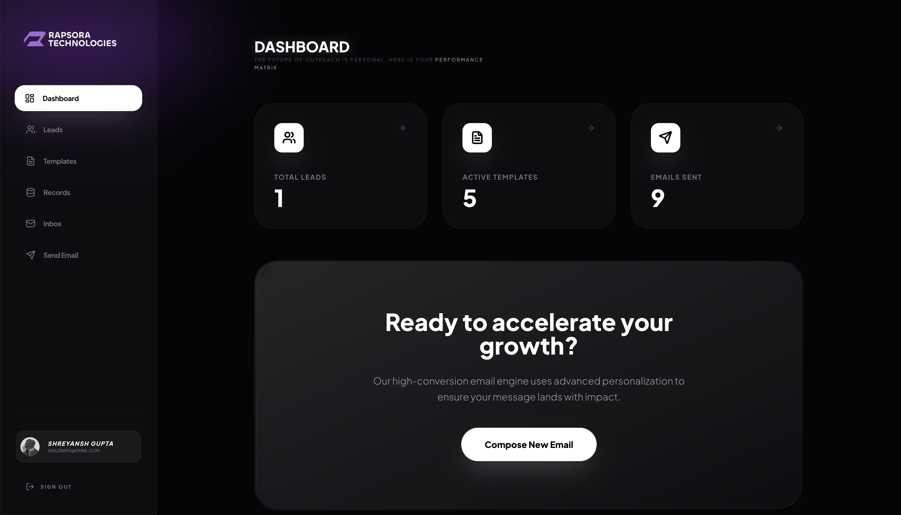
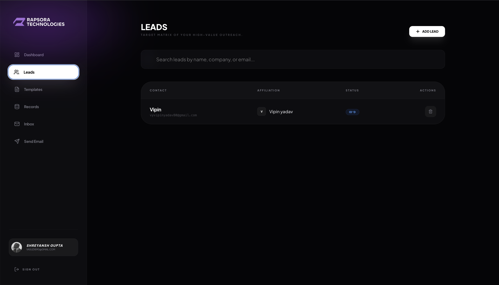
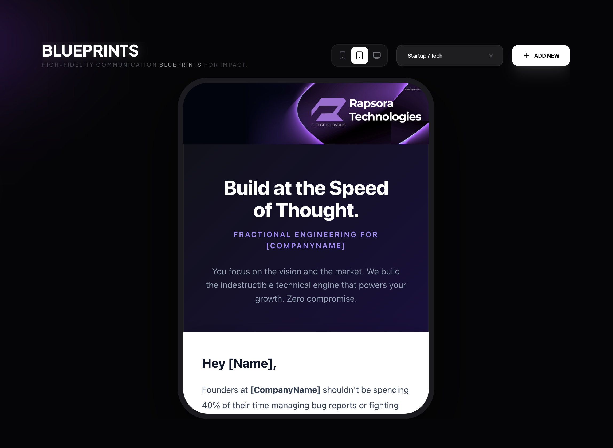
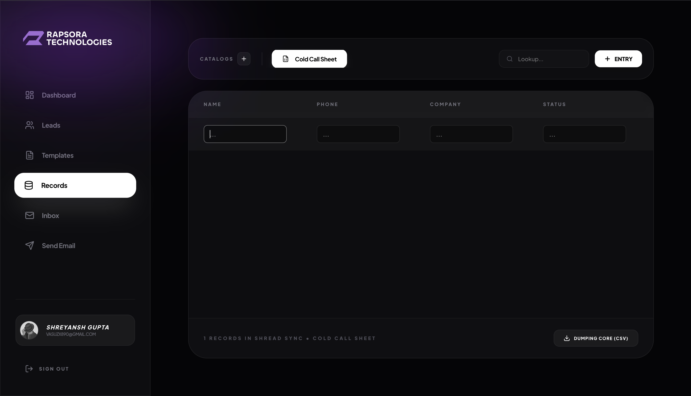

<div align="center">
  
  
  # RAPSORA OUTREACH
  ### High-Fidelity Outreach Engine — Records Management — Intelligence Matrix
  
  *The ultimate transmission system for professional sales and intelligence operations.*

  <div style="display: flex; justify-content: center; gap: 10px; margin-top: 20px;">
    
    
    
  </div>
</div>

---

## 🛰️ Overview
**RapSora Outreach** is a sophisticated, high-performance engine designed to streamline professional outreach and lead management. Built with a signature **"Liquid Glass"** aesthetic, it combines military-grade records management with a cinematic user experience.

---

## 📸 Interface Preview

<div align="center">
  <table style="width: 100%; border-collapse: collapse;">
    <tr>
      <td width="50%"><p align="center"><b>Main Command Dashboard</b></p></td>
      <td width="50%"><p align="center"><b>Intelligence Matrix (Leads)</b></p></td>
    </tr>
    <tr>
      <td width="50%"><p align="center"><b>Blueprint Editor (Templates)</b></p></td>
      <td width="50%"><p align="center"><b>Shread Sync (Records)</b></p></td>
    </tr>
  </table>
</div>

---

## ⚡ Core Features

### 🛠️ Precision Outreach Engine
The heart of RapSora. A high-velocity transmission system designed for scale.
- **Dynamic Variable Injection**: Real-time token swapping for `[Name]`, `[CompanyName]`, and custom metadata.
- **Telemetry & Tracking**: Advanced delivery monitoring with status updates for every transmission.
- **Industrial-Grade Delivery**: Deep integration with Resend for high deliverability and spam protection.

### 🎨 High-Fidelity Blueprints
Advanced email template management with integrated visualization tools.
- **Live Visual Sandbox**: Instant side-by-side rendering of HTML blueprints.
- **Responsive Simulation**: Built-in toggles for Desktop, Tablet, and Mobile viewports.
- **Snippet Library**: Save and reuse modular content blocks across different campaigns.

### 📊 Shread Sync (Proprietary Sheet System)
A custom-engineered data grid for collaborative records management.
- **Multi-Pipeline Architecture**: Create specialized catalogs (e.g., "Seed Round", "Enterprise Sales").
- **Real-time Row Operations**: High-speed entry, editing, and deletion with auto-save.
- **Intelligence Export**: One-click "Core Dump" to CSV for external CRM integration.

### 🛡️ Hardened Security Matrix
Enterprise-grade protection ensuring data integrity and authorized access.
- **Gatekeeper Protocol**: Environment-level whitelisting via `ALLOWED_EMAILS`.
- **Identity Synthesis**: Seamless Google OAuth integration with session persistence.
- **Access Revoked Protocol**: Custom security intercept branding for unauthorized attempts.

---

## 🛠️ Tech Stack

- **Framework**: [Next.js 15](https://nextjs.org/) (App Router & React 19)
- **Database**: [MongoDB](https://www.mongodb.com/) (Mongoose ODM with High-Concurrency Pooling)
- **Authentication**: [NextAuth.js v5](https://authjs.dev/)
- **Email Transmission**: [Resend API](https://resend.com/)
- **Animation Suite**: [Framer Motion](https://www.framer.com/motion/) (Liquid UI Transitions)
- **Styling**: [Tailwind CSS](https://tailwindcss.com/) (Custom Liquid Glass Design System)

---

## 📂 Project Architecture

```text
rapsora-outreach/
├── app/                        # Next.js 15 App Router
├── components/                 # Premium UI Modules (Dashboard, Sheets, SendEmail)
├── lib/                        # Core Infrastructure (Auth, Database, Templates)
├── models/                     # Mongoose Data Schemas
└── public/                     # Brand Assets & Collateral
```

---

## 🚀 Getting Started

### 1. Environment Setup
Create a `.env.local` file in the root directory:

```env
MONGODB_URI=        # MongoDB Connection String
GOOGLE_CLIENT_ID=   # Google Cloud Console OAuth ID
GOOGLE_CLIENT_SECRET=
AUTH_SECRET=        # NextAuth Encryption Key (Generate with `openssl rand -base64 32`)
RESEND_API_KEY=     # Resend.com API Key
ALLOWED_EMAILS=     # Comma-separated list (e.g., user1@email.com,user2@email.com)
```

### 2. Installation
```bash
npm install
npm run dev
```

---

<div align="center">
  <p><b>RapSora Technologies — All Rights Reserved © 2026</b></p>
  <p><i>Building the future of professional communication.</i></p>
</div>
